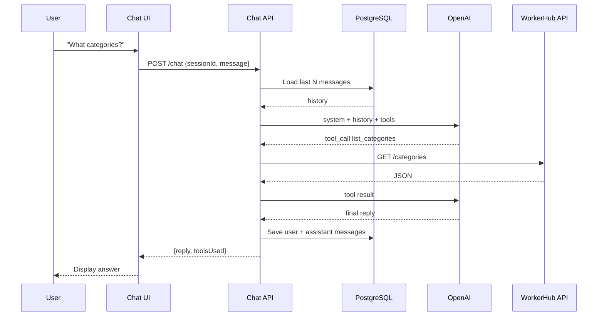

# WorkerHub AI Chat — Full Architecture (Interview Guide)

This document explains the WorkerHub AI assistant end-to-end: UI → Chat API → LLM (OpenAI) → tools → WorkerHub API, plus how conversation context is stored. Use it to walk an interviewer through the design.

---

## 1. One-line pitch

> “We built an AI assistant for WorkerHub that answers questions about services and categories. The LLM decides when to call our backend tools; conversation history is stored in our database so the assistant remembers prior messages across sessions.”

---

## 2. The problem we’re solving

WorkerHub has real data — categories, services, providers, prices — behind authenticated APIs. Users ask natural-language questions like:

- “What services do you offer?”
- “Show me car cleaning options and prices”
- “Hi, I booked yesterday — what’s available near me?”

A plain chatbot without tools would **hallucinate** prices and services. We need:

1. An **LLM** for language and reasoning
2. **Tools** that fetch real data from the WorkerHub API
3. **Context storage** so multi-turn conversations work (“show me more” / “what about the cheaper one?”)

---

## 3. High-level architecture

```text
┌──────────────┐     ┌─────────────────┐     ┌──────────────┐
│  Web / Mobile│────▶│  Chat API       │────▶│  PostgreSQL  │
│  Chat UI     │     │  (Node/Express) │     │  sessions +  │
│              │◀────│                 │◀────│  messages    │
└──────────────┘     └────────┬────────┘     └──────────────┘
                              │
                    ┌─────────┴─────────┐
                    ▼                   ▼
            ┌──────────────┐    ┌──────────────────┐
            │  OpenAI API  │    │  WorkerHub API   │
            │  (LLM brain) │    │  (tools / data)  │
            └──────────────┘    └──────────────────┘
```

### Separation of concerns

| Layer | Responsibility |
|-------|----------------|
| **UI** | Display chat, send `sessionId` + new message |
| **Chat API** | Load history, orchestrate LLM + tools, save replies |
| **Database** | Durable conversation memory |
| **OpenAI** | Language understanding + tool-call decisions (stateless per request) |
| **WorkerHub API** | Source of truth for categories, services, bookings |

---

## 4. End-to-end request flow (with context)

### Step 1 — User sends a message

```json
POST /chat
{
  "sessionId": "abc-123",
  "message": "What categories do you have?"
}
```

### Step 2 — Chat API loads context from DB

```sql
SELECT role, content FROM messages
WHERE session_id = 'abc-123'
ORDER BY created_at ASC
LIMIT 20;
```

Example history:

```text
user:      "Hi"
assistant: "Hello! How can I help with WorkerHub services?"
user:      "What categories do you have?"   ← new message (also saved)
```

### Step 3 — Build the LLM payload

Send OpenAI:

- **System prompt** — role, rules, when to use tools
- **Conversation history** — from DB
- **Tool definitions** — e.g. `workerhub_list_categories`, `workerhub_list_services`

### Step 4 — OpenAI responds

Two outcomes:

**A) Plain text** (greeting, clarification):

```json
{ "content": "Hello! I can help you browse WorkerHub services." }
```

**B) Tool call** (needs real data):

```json
{
  "tool_calls": [{
    "name": "workerhub_list_categories",
    "arguments": {}
  }]
}
```

### Step 5 — Execute tools locally (our server, not OpenAI)

```text
runTool("workerhub_list_categories")
  → GET https://api.workerhub.com/categories
  → returns JSON
```

OpenAI never calls WorkerHub directly. **Our backend owns tool execution** — important for auth, validation, and security.

### Step 6 — Send tool result back to OpenAI

```json
{ "role": "tool", "content": "{ \"categories\": [...] }" }
```

OpenAI turns that into a human answer:

> “We offer Car Cleaning, Maid Service, Plumbing…”

### Step 7 — Persist to DB

```text
INSERT message (session_id, role=user, content=...)
INSERT message (session_id, role=assistant, content=..., tools_used=[...])
```

### Step 8 — Return to UI

```json
{
  "reply": "We offer Car Cleaning, Maid Service...",
  "toolsUsed": ["workerhub_list_categories"]
}
```

---

## 5. The tool-calling loop (core concept)

This is the pattern interviewers care about:

```text
while (model wants tools) {
  1. Call OpenAI with messages + tools
  2. If tool_calls → execute each tool on OUR server
  3. Append tool results to messages
  4. Repeat
}
return final text reply
```

### Why this design?

- **LLM** = decision maker (when to fetch data, how to summarize)
- **Our API** = executor (JWT, rate limits, business rules)
- **WorkerHub API** = source of truth

The same tools work with OpenAI, Claude, or Ollama — only the LLM adapter changes.

### Current demo (`packages/app`)

The demo under `mcp/` implements this loop in `chat.ts`:

- Tools are defined in `tools.ts` and executed via `runtime.ts` → `workerhub-client.ts`
- Today the demo uses **Ollama locally** and sends **one message per request** (no DB yet)
- Production adds Postgres history + OpenAI (or Claude) with the same tool layer

---

## 6. Where context lives (critical interview point)

| What | Where | Why |
|------|--------|-----|
| **Conversation history** | **Our PostgreSQL DB** | Durable, queryable, tied to `userId` / `sessionId` |
| **Current request messages** | Built in memory on each `/chat` | Assembled from DB + new message |
| **OpenAI** | Processes one request at a time | **Does not** store our chat unless we use Assistants/Threads API |
| **Browser** | Optional UI cache | Display only; DB is source of truth |

### Key line for interviews

> “OpenAI is stateless in our design. We own conversation memory in Postgres. Every request, we load history, send it to the model, save the new turn, and return the reply.”

That shows you understand **who owns state** — a common follow-up question.

---

## 7. Database schema (simple version)

```text
sessions
  id            UUID PK
  user_id       UUID FK (nullable for anonymous demo)
  created_at    timestamp
  updated_at    timestamp

messages
  id            UUID PK
  session_id    UUID FK → sessions
  role          enum: system | user | assistant | tool
  content       text
  tools_used    jsonb (optional)
  created_at    timestamp
```

### Optional later

- `token_count` for cost tracking
- `summary` for long threads (see below)
- `metadata` (model name, latency)

---

## 8. Context window and cost control

You don’t send **entire** history forever:

1. **Sliding window** — last N messages (e.g. 20)
2. **Summarization** — older turns → one summary row
3. **Token budget** — trim until under limit

Example:

```text
[summary of messages 1–50]
[user: message 51]
[assistant: message 52]
[user: message 53]  ← current
```

**Interview point:** Storage is cheap; **LLM tokens are not**. DB holds everything; the prompt sends a curated subset.

---

## 9. Why PostgreSQL (not a GCS bucket)

| Need | Postgres | GCS bucket |
|------|----------|------------|
| Append message | `INSERT` one row | Rewrite file or new blob |
| Load session history | `WHERE session_id = ? ORDER BY created_at` | List + read many files |
| Join with users/bookings | Native SQL | Not suitable |
| Concurrent chats | Built for it | Poor fit |

**Bucket use:** exports, attachments, backups — not primary chat state.

### GCP options

| Service | When to use |
|---------|-------------|
| **Cloud SQL (PostgreSQL)** | Best default — same as WorkerHub main app, SQL joins, audit |
| **Firestore** | Serverless MVP, document tree per user/session |
| **Memorystore (Redis)** | Hot session cache only — pair with Postgres |
| **Cloud Storage** | File attachments, transcript exports, backups |

For WorkerHub, **Postgres (Cloud SQL or Neon)** is the natural choice because the rest of the platform already uses it.

---

## 10. OpenAI vs local Ollama

| | Ollama (local) | OpenAI API |
|---|----------------|------------|
| **Tool routing** | Weak on small models (e.g. llama3.1) | Strong |
| **Data privacy** | Stays on your machine | Sent to OpenAI per request |
| **Cost** | Infra only | Per token |
| **Ops** | Run GPU/CPU locally | API key + HTTP |

- **Demo:** Ollama for local learning, no API cost
- **Production:** OpenAI (or Claude) for reliability, better tool decisions, and context assembled from our DB

---

## 11. Security and auth

1. **User → Chat API** — JWT / session cookie
2. **Chat API → WorkerHub API** — service token or user-scoped JWT
3. **Chat API → OpenAI** — server-side API key only (never in browser)
4. **Tool execution** — only on backend; validate args before calling WorkerHub
5. **PII** — don’t log full prompts in production; respect retention policy

### Interview line

> “The client never holds the OpenAI key or WorkerHub service credentials. All tool calls go through our API gateway where we enforce auth and audit.”

---

## 12. Demo vs production

| Demo (`mcp/` today) | Production version |
|---------------------|-------------------|
| Single message per request | `sessionId` + DB history |
| Ollama locally | OpenAI / Claude |
| Tools in-process (`tools.ts`) | Same pattern, more tools (bookings, invoices) |
| No persistence | Postgres `sessions` + `messages` |
| JWT in `.env` | Per-user tokens from auth |

The **architecture pattern** is the same; production adds persistence, auth, and a stronger LLM.

---

## 13. 60-second interview walkthrough

> “We have a chat assistant for WorkerHub. When a user sends a message, our Chat API loads the last N messages for that session from Postgres, appends the new user message, and calls OpenAI with a system prompt plus tool definitions for things like listing categories and services.
>
> OpenAI either replies directly — for greetings — or returns a tool call. We execute that tool against our WorkerHub REST API using proper JWT auth, send the JSON result back to OpenAI, and loop until we get a final natural-language answer.
>
> We then save both the user message and assistant reply to Postgres. OpenAI doesn’t store our conversation; we do. That gives us multi-turn context, auditability, and control over what we send to the model — we can trim or summarize old messages to manage token cost.
>
> We chose Postgres over object storage because we need fast ordered queries by session and optional joins to users and bookings. GCS would only be for attachments or archival exports.”

---

## 14. Sequence diagram



---

## 15. Likely follow-up questions

### Why not store context in OpenAI Threads?

We can, but then history lives with the vendor, is harder to join with our user/booking data, and couples us to OpenAI. Owning Postgres keeps portability (swap OpenAI for Claude) and full control.

### How do you prevent hallucinated prices?

Prices only come from tool results (`list_services` → `pricePaise`). System prompt instructs: summarize tool data, don’t invent numbers.

### What if the model calls the wrong tool?

Stronger model + clear tool descriptions + system prompt. Fallback: validate tool args server-side; return errors as tool results so the model can recover.

### How do you scale?

Stateless API behind load balancer; Postgres for sessions; optional Redis cache for hot sessions; rate limits per user.

### What drives cost?

OpenAI input tokens — especially conversation history. History trimming and summarization matter more than DB choice.

---

## 16. Code map (current demo)

```text
mcp/
├── packages/app/
│   ├── src/index.ts           # HTTP server, POST /chat
│   ├── src/chat.ts            # LLM tool-calling loop
│   ├── src/tools.ts           # Tool definitions (categories, services)
│   ├── src/runtime.ts         # Tool runner (in-process)
│   └── src/workerhub-client.ts # WorkerHub REST client
└── packages/web/              # Vite chat UI
```

Run locally: `cd mcp && pnpm dev` → UI at http://localhost:5174, API at http://localhost:8787.

See also [README.md](./README.md) for setup and environment variables.
