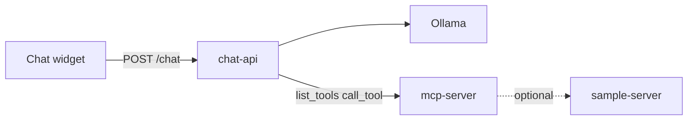

# MCP Chat Template

Embeddable chat widget + **Ollama (Llama)** host + **MCP** tool server. Fork this template to add AI chat with custom tools on any website.

**Full documentation:** [docs/GUIDE.md](docs/GUIDE.md)

## What you get

| Folder | Required? | Role |
|--------|-------------|------|
| [mcp-server/](mcp-server/) | Yes | MCP tools (e.g. call your APIs) |
| [chat-api/](chat-api/) | Yes | Ollama + MCP client — **only URL the widget calls** |
| [widget/](widget/) | Yes (build) | `chat-widget.js` embed script |
| [web/](web/) | No | Demo HTML page |
| [sample-server/](sample-server/) | No | Mock API for sample `list_employees` tool |

## Architecture



**Llama decides** whether to reply in text or call a tool. The MCP server runs tools; it does not run the LLM.

## Quickstart

**Prerequisites:** Node 20+, pnpm, [Ollama](https://ollama.com) running on `:11434`

1. **Ollama running** — on macOS, open the Ollama app (or ensure `curl http://127.0.0.1:11434/api/tags` works). You do **not** need `ollama run llama3.1`.
2. **Model pulled once** — `pnpm setup:ollama` (downloads `llama3.1`; chat-api loads it on each request).

```bash
cp .env.example .env
pnpm install
pnpm setup:ollama    # one-time: ollama pull llama3.1
pnpm build
pnpm dev             # MCP :8788 + chat-api :8787 + demo web :5174
```

Open http://localhost:5174 or use curl:

```bash
curl -s -X POST http://127.0.0.1:8787/chat \
  -H 'Content-Type: application/json' \
  -d '{"message":"hi"}' | jq
```

**With sample tool** (employee list):

```bash
pnpm dev:all         # also starts sample-server :9000
```

## Embed on your site

```html
<script
  src="https://YOUR_SERVER/chat-widget.js"
  data-api-url="https://YOUR_SERVER"
  data-title="Support Chat"
  defer
></script>
<div id="mcp-chat"></div>
```

Set `CORS_ORIGINS` on chat-api for your site's origin. See [docs/GUIDE.md § Embed](docs/GUIDE.md#6-the-micro-frontend-widget).

## Scripts

| Command | Starts |
|---------|--------|
| `pnpm dev` | mcp-server + chat-api + web demo |
| `pnpm dev:all` | above + sample-server |
| `pnpm dev:mcp` | MCP server only |
| `pnpm dev:api` | chat-api only |
| `pnpm dev:sample` | sample-server only |
| `pnpm dev:web` | static demo page :5174 |
| `pnpm build` | compile all packages + widget |
| `pnpm setup:ollama` | pull Ollama model |

## Environment

Copy [.env.example](.env.example) → `.env`. Key variables:

| Variable | Service |
|----------|---------|
| `MCP_SERVER_URL` | chat-api → mcp-server |
| `CHAT_API_PORT` | chat-api (default 8787) |
| `OLLAMA_BASE_URL`, `OLLAMA_MODEL` | chat-api |
| `CORS_ORIGINS` | chat-api |
| `SAMPLE_API_URL` | mcp-server sample tool |

## Troubleshooting

| Problem | Fix |
|---------|-----|
| Cannot connect to MCP server | Run `pnpm dev:mcp` before chat-api |
| CORS error in browser | Add your site to `CORS_ORIGINS` |
| Ollama errors | Ensure Ollama is running (`curl :11434/api/tags`) and run `pnpm setup:ollama` |
| Tool fails on employees | Run `pnpm dev:sample` or disable sample tool |

More: [docs/GUIDE.md § Troubleshooting](docs/GUIDE.md#13-troubleshooting)

## License

MIT — see [LICENSE](LICENSE)
