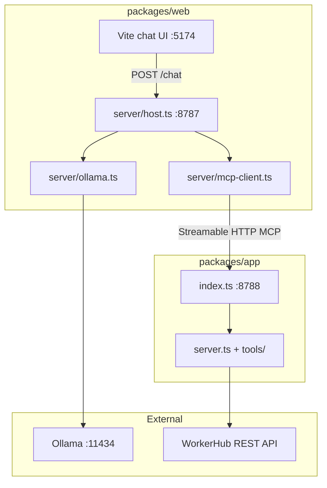
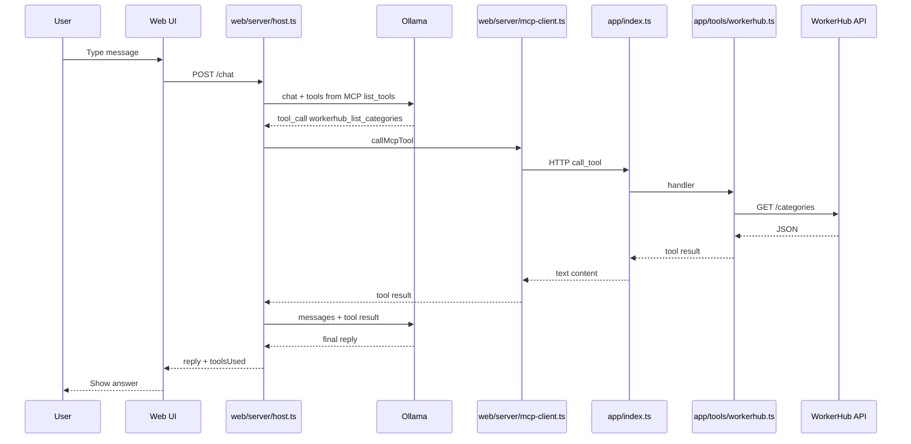

# WorkerHub MCP + Ollama chat demo

Isolated experiment under `mcp/`. Not part of main WorkerHub CI or production. Delete this folder to remove it entirely.

## What this is

A **chat assistant** for WorkerHub that uses:

1. An **MCP server** — exposes WorkerHub data as MCP tools (categories, services).
2. A **web stack** — browser UI + API that runs **Ollama (Llama)** and talks to the MCP server over HTTP.

The MCP server and the web API are **separate processes**. The web layer does not import tool logic from the MCP package except for the server URL (`@workerhub-mcp/app/config`). All tool execution happens inside the MCP server.

---

## Architecture overview



### Who does what (MCP vocabulary)

| Role | Where | Responsibility |
|------|--------|----------------|
| **MCP server** | `packages/app` | Registers tools, runs `workerhub_list_*`, calls WorkerHub API |
| **MCP host** | `packages/web/server` | Runs the agent loop: Ollama + `list_tools` / `call_tool` on the server |
| **LLM** | Ollama (local) | Decides when to reply vs call a tool; never speaks MCP directly |
| **UI** | `packages/web/src` | Sends user messages to the web API only |

Ollama does **not** connect to the MCP server. The **web host** (`mcp-client.ts` + `ollama.ts`) bridges Ollama’s function-calling format and MCP’s `list_tools` / `call_tool`.

---

## Request flow: one chat message



Steps in plain language:

1. Browser posts `{ "message": "..." }` to the **web API** (`:8787`).
2. `ollama.ts` loads tool definitions via **`list_tools`** on the MCP server (`:8788`).
3. Ollama may return a **tool call**; the host runs **`call_tool`** on the MCP server (not WorkerHub directly).
4. MCP server fetches real data from **WorkerHub**, returns JSON to the host.
5. Host sends the tool result back to Ollama until there is a final text reply.

---

## Repository layout

```text
mcp/
├── .env                    # secrets (not committed)
├── .env.example
├── package.json            # pnpm dev runs MCP + web together
├── packages/
│   ├── app/                # MCP server only
│   │   ├── index.ts        # HTTP entry → /mcp
│   │   ├── server.ts       # createWorkerHubMcpServer()
│   │   ├── config.ts       # getMcpServerUrl() (for web client)
│   │   └── tools/
│   │       └── workerhub.ts
│   └── web/                # UI + web API (MCP host)
│       ├── src/            # Vite chat widget
│       └── server/
│           ├── host.ts     # Express POST /chat
│           ├── mcp-client.ts
│           └── ollama.ts
```

| File | Service | Purpose |
|------|---------|---------|
| `app/index.ts` | MCP | Streamable HTTP transport, `POST/GET/DELETE /mcp` |
| `app/tools/workerhub.ts` | MCP | `registerWorkerHubTools`, WorkerHub fetch |
| `web/server/host.ts` | Web API | CORS, `/health`, `/chat` |
| `web/server/mcp-client.ts` | Web API | `StreamableHTTPClientTransport` → `MCP_SERVER_URL` |
| `web/server/ollama.ts` | Web API | Ollama tool-calling loop |

---

## Ports and URLs

| What | Default | Env var |
|------|---------|---------|
| MCP server | http://127.0.0.1:8788/mcp | `MCP_PORT`, `MCP_SERVER_URL` |
| Web chat API | http://127.0.0.1:8787 | `BRIDGE_PORT` |
| Web UI | http://127.0.0.1:5174 | — |
| Ollama | http://127.0.0.1:11434 | `OLLAMA_BASE_URL` |

---

## Prerequisites

- **Node.js 20+** and **pnpm**
- **Ollama**: `ollama serve` and `ollama pull llama3.1` (or set `OLLAMA_MODEL`)
- **WorkerHub API** + JWT in `.env` for `WORKERHUB_ACCESS_TOKEN`

---

## Setup

```bash
cd mcp
cp .env.example .env
# Edit .env: WORKERHUB_ACCESS_TOKEN, etc.
pnpm install
pnpm build
```

---

## Run

### Both services (recommended)

```bash
pnpm dev
```

Starts:

- **MCP server** on port **8788**
- **Web UI** on **5174** and **web API** on **8787**

### Separate terminals (same as production-style deployment)

```bash
# Terminal 1 — MCP server (must be up first)
pnpm dev:mcp

# Terminal 2 — web API + UI
pnpm dev:api    # API only
pnpm dev:web    # UI only (or use full `pnpm --filter @workerhub-mcp/web dev` for both)
```

If the web API starts before MCP, `connectMcpClient()` fails with a message to run `pnpm dev:mcp` first.

---

## Environment variables

| Variable | Used by | Description |
|----------|---------|-------------|
| `WORKERHUB_API_BASE_URL` | MCP server | WorkerHub API base |
| `WORKERHUB_ACCESS_TOKEN` | MCP server | JWT for authenticated endpoints |
| `MCP_PORT` | MCP server | Listen port (default `8788`) |
| `MCP_SERVER_URL` | Web MCP client | Full MCP endpoint (default `http://127.0.0.1:8788/mcp`) |
| `OLLAMA_BASE_URL` | Web API | Ollama URL |
| `OLLAMA_MODEL` | Web API | Model name (default `llama3.1`) |
| `BRIDGE_PORT` | Web API | Chat API port (default `8787`) |
| `VITE_BRIDGE_URL` | Web UI | Where the widget sends `POST /chat` |

---

## MCP tools exposed

| Tool | When to use |
|------|-------------|
| `workerhub_list_categories` | User asks about categories / service types |
| `workerhub_list_services` | User asks about services, prices, availability |

Defined once in `app/tools/workerhub.ts` and registered on `McpServer` in `app/server.ts`.

---

## Package exports (`@workerhub-mcp/app`)

| Export | Purpose |
|--------|---------|
| `@workerhub-mcp/app/server` | `createWorkerHubMcpServer()` |
| `@workerhub-mcp/app/config` | `getMcpServerUrl()` for the web MCP client |

The web package depends on these; it does not duplicate tool implementations.

---

## Smoke tests

```bash
# Health (Ollama + WORKERHUB_API_BASE_URL set)
curl -s http://localhost:8787/health | jq

# Chat (MCP server must be running)
curl -s -X POST http://localhost:8787/chat \
  -H 'Content-Type: application/json' \
  -d '{"message":"What categories are on WorkerHub?"}' | jq
```

Expect `toolsUsed` to include `workerhub_list_categories` when the model routes correctly.

---

## Ollama notes

`llama3.1` is weak at choosing chat vs tools. Mitigations in `ollama.ts`:

- System prompt: reply for greetings; tools only for WorkerHub data questions
- Retry without tools if the model returns a meta “no response needed” style reply

For better tool routing: `OLLAMA_MODEL=qwen2.5` after `ollama pull qwen2.5`.

---

## Delete this demo

```bash
# From repo root, with dev servers stopped
rm -rf mcp
```
