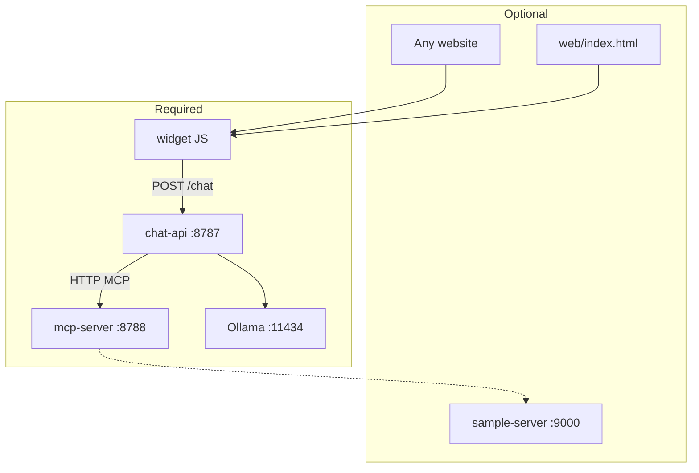
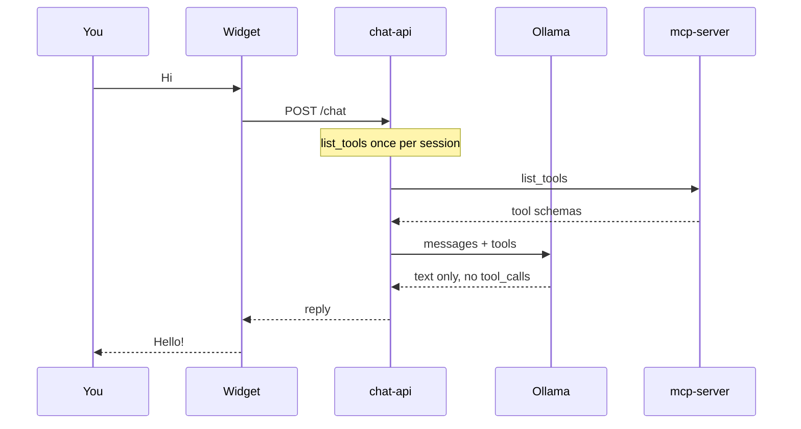
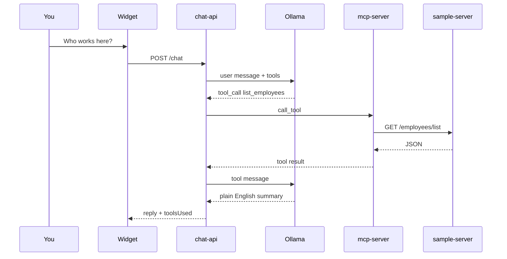

# MCP Chat Template — Full Guide

This is the main documentation for the template. The [README](../README.md) is a short entry point; read this guide to understand, run, extend, and deploy the stack.

---

## 1. Introduction

### Who this is for

Teams who want:

- A **drop-in chat UI** (micro-frontend) for any website
- **Local Llama** via [Ollama](https://ollama.com) (no OpenAI bill for dev)
- **Real tools** via [Model Context Protocol (MCP)](https://modelcontextprotocol.io) — your APIs, databases, or mock services

### What MCP is (one paragraph)

MCP is an open protocol for connecting AI applications to **tools** and data. A **server** exposes tools (`list_employees`, `search_orders`, …). A **host** runs the LLM and calls those tools when the model asks. This template gives you both pieces plus an embeddable widget.

### What this template is not

- Not a hosted SaaS — you run processes on your machine or server
- Not tied to any specific product API — the sample uses a fake employee list
- Not “Llama inside the MCP server” — the LLM runs in **chat-api**; the MCP server only runs tools (standard MCP layout)

---

## 2. Concepts (read this first)

### Four roles

| Role | Package | What it does |
|------|---------|--------------|
| **Widget** | `widget/` | Browser UI; `POST /chat` to chat-api only |
| **MCP host** | `chat-api/` | Ollama + MCP client; runs the agent loop |
| **MCP server** | `mcp-server/` | Registers and executes tools |
| **LLM** | Ollama | Decides text vs tool calls; writes final answer |

### Who decides: Llama or MCP?

**Llama decides** each turn:

- **Text only** → greeting, general chat → reply goes to the user. **No MCP tool runs.**
- **`tool_calls`** → host calls **MCP server** → tool result back to Llama → Llama summarizes in plain language.

The host does **not** guess upfront. It always asks Llama first (with tools available).

### Component diagram



### Message flow: “Hi”



**WorkerHub API is not called.** `toolsUsed` is empty.

### Message flow: “List employees”



---

## 3. Repository map

```text
mcp-chat-template/
├── README.md
├── docs/GUIDE.md          ← you are here
├── .env.example
├── scripts/setup-ollama.sh
├── mcp-server/            REQUIRED
├── chat-api/              REQUIRED
├── widget/                REQUIRED (build)
├── web/                   OPTIONAL demo
└── sample-server/         OPTIONAL mock API
```

### Required vs optional

| Component | Required? | When to skip |
|-----------|-------------|--------------|
| Ollama | Yes | — |
| mcp-server | Yes | — |
| chat-api | Yes | — |
| widget (`pnpm build`) | Yes to embed | — |
| web/ | No | You embed on your own site |
| sample-server | No | Comment out sample tool in `mcp-server/tools/index.ts` |

---

## 4. Prerequisites and setup

### Install

- **Node.js 20+**
- **pnpm** — `npm install -g pnpm`
- **Ollama** — https://ollama.com/download  
  - Windows: use installer from site; then `ollama pull llama3.1` in a terminal

### Ollama setup script

```bash
pnpm setup:ollama
ollama serve    # keep running in a terminal
```

### Project setup

```bash
cp .env.example .env
pnpm install
pnpm build
```

### Environment variables

| Variable | Read by | Meaning |
|----------|---------|---------|
| `MCP_PORT` | mcp-server | Default `8788` |
| `MCP_SERVER_URL` | chat-api | Full MCP URL, default `http://127.0.0.1:8788/mcp` |
| `CHAT_API_PORT` | chat-api | Default `8787` |
| `OLLAMA_BASE_URL` | chat-api | Default `http://127.0.0.1:11434` |
| `OLLAMA_MODEL` | chat-api | Default `llama3.1` |
| `CORS_ORIGINS` | chat-api | `*` or comma-separated origins |
| `SAMPLE_API_URL` | mcp-server sample tool | Default `http://127.0.0.1:9000` |
| `SAMPLE_PORT` | sample-server | Default `9000` |

---

## 5. Running locally

### Minimal (chat only)

```bash
# Terminal 1
ollama serve

# Terminal 2
pnpm dev:mcp

# Terminal 3
pnpm dev:api

# Terminal 4 (optional UI)
pnpm dev:web
```

Or one command (after `ollama serve`):

```bash
pnpm dev
```

### Full demo (with sample API)

```bash
pnpm dev:all
```

### Ports

| Port | Service |
|------|---------|
| 8787 | chat-api — **widget `apiUrl`** |
| 8788 | mcp-server — `/mcp` |
| 9000 | sample-server — `/employees/list` |
| 11434 | Ollama |
| 5174 | web demo static server |

### curl smoke tests

```bash
curl -s http://127.0.0.1:8787/health | jq

curl -s -X POST http://127.0.0.1:8787/chat \
  -H 'Content-Type: application/json' \
  -d '{"message":"hi"}' | jq

curl -s -X POST http://127.0.0.1:8787/chat \
  -H 'Content-Type: application/json' \
  -d '{"message":"List all employees"}' | jq
```

For the last command, run `pnpm dev:sample` or `pnpm dev:all`.

### POST /chat API

**Request:**

```json
{ "message": "your text here" }
```

**Response:**

```json
{
  "reply": "assistant text",
  "toolsUsed": ["list_employees"]
}
```

**Error:**

```json
{ "error": "description" }
```

---

## 6. The micro-frontend (widget)

### Build

```bash
pnpm --filter @mcp-chat-template/widget build
```

Output: `widget/dist/chat-widget.js`

chat-api serves it at `http://127.0.0.1:8787/chat-widget.js` after build.

### Script tag embed

```html
<script
  src="http://127.0.0.1:8787/chat-widget.js"
  data-api-url="http://127.0.0.1:8787"
  data-title="My Chat"
  data-container="mcp-chat"
  defer
></script>
<div id="mcp-chat"></div>
```

| Attribute | Meaning |
|-----------|---------|
| `data-api-url` | chat-api base URL (**required** for cross-origin) |
| `data-title` | Header title |
| `data-container` | DOM id to mount into (default `mcp-chat`) |

### Programmatic API

```javascript
McpChatWidget.mountChatWidget(document.getElementById('el'), {
  apiUrl: 'http://127.0.0.1:8787',
  title: 'Support',
});
```

### CORS

If the parent page is `https://myshop.com` and chat-api is `https://api.myshop.com`, set:

```bash
CORS_ORIGINS=https://myshop.com,https://www.myshop.com
```

### Production checklist

- Serve chat-api and widget JS over **HTTPS**
- Do not expose Ollama to the public internet
- Set explicit `CORS_ORIGINS` (avoid `*` in production)
- Point `data-api-url` at your public chat-api URL

---

## 7. The chat API (`chat-api`)

- **Only** service the browser should call
- **`agent.ts`** — Ollama loop; loads tools from MCP; calls `call_tool` when Llama asks
- **`mcp-client.ts`** — HTTP client to `MCP_SERVER_URL`
- Do **not** call Ollama or MCP from the browser

---

## 8. The MCP server (`mcp-server`)

- Exposes tools at `http://127.0.0.1:8788/mcp`
- **`tools/index.ts`** — register your tools here
- **`tools/sample-employees.ts`** — commented template

Test with [MCP Inspector](https://github.com/modelcontextprotocol/inspector) while `pnpm dev:mcp` is running.

---

## 9. Adding your own tools

1. Copy `mcp-server/tools/sample-employees.ts` → `my-tool.ts`
2. Change tool name, `description`, `inputSchema` (Zod)
3. Implement handler: fetch your API, return `{ content: [{ type: 'text', text: '...' }] }`
4. Import and call `registerMyTool(server)` in `tools/index.ts`
5. Restart mcp-server
6. chat-api picks up new tools on next `list_tools` (restart chat-api or new process)

### Annotated template (sample-employees.ts)

Read the file top-to-bottom:

- **File header** — how to copy and wire env vars
- **`registerListEmployeesTool`** — `server.registerTool(name, metadata, handler)`
- **`inputSchema`** — Zod; use `z.object({ id: z.string() })` for parameters
- **Handler** — runs on MCP server; safe to call internal APIs

---

## 10. Optional: sample-server

Mock REST API for the template tool.

```bash
pnpm dev:sample
curl -s http://127.0.0.1:9000/employees/list | jq
```

Response shape:

```json
{
  "employees": [
    { "id": "1", "name": "Alex Chen", "role": "Engineer", "department": "Platform" }
  ]
}
```

---

## 11. Optional: demo web page (`web/`)

Static `web/index.html` loads the widget from chat-api. Use it to verify the stack before embedding on your site.

```bash
pnpm dev:web
```

Open http://localhost:5174

---

## 12. Deployment (outline)

On a VM or container host, run as separate processes:

1. **Ollama** — `ollama serve` (localhost only)
2. **mcp-server** — `node mcp-server/dist/index.js`
3. **chat-api** — `node chat-api/dist/index.js`
4. Reverse proxy (nginx) — TLS for chat-api + `/chat-widget.js`

Set production `.env` and embed:

```html
<script src="https://api.example.com/chat-widget.js" data-api-url="https://api.example.com" defer></script>
```

**Security (v1):** No auth on `/chat` — add your own middleware before going public.

---

## 13. Troubleshooting

| Symptom | Cause | Fix |
|---------|-------|-----|
| Cannot connect to MCP server | mcp-server not running | `pnpm dev:mcp` first |
| CORS error | Origin not allowed | Set `CORS_ORIGINS` |
| Ollama connection failed | `ollama serve` not running | Start Ollama |
| Tool error / sample API | sample-server down | `pnpm dev:sample` or disable tool |
| Empty / weird replies | Weak model routing | Try `OLLAMA_MODEL=qwen2.5` |
| `chat-widget.js` 404 | Widget not built | `pnpm build` |

---

## 14. FAQ

**Can I use OpenAI instead of Ollama?**  
Replace fetch calls in `chat-api/agent.ts` with OpenAI Chat Completions + tools. MCP server stays the same.

**Can I merge mcp-server and chat-api into one process?**  
Yes, but this template keeps them separate so you can scale or replace parts independently.

**Can I add many tools?**  
Yes — register each on mcp-server. The host loads all via `list_tools`.

**Does the widget talk to MCP?**  
No. Widget → chat-api only.

---

## 15. Glossary

| Term | Meaning |
|------|---------|
| **MCP server** | Process that exposes `list_tools` / `call_tool` |
| **MCP host** | Process that runs the LLM and calls the MCP server |
| **MCP client** | Library in chat-api that talks to MCP server |
| **Tool** | Named function the LLM can invoke |
| **Ollama** | Local LLM runtime |
| **Widget** | Embeddable `chat-widget.js` |
